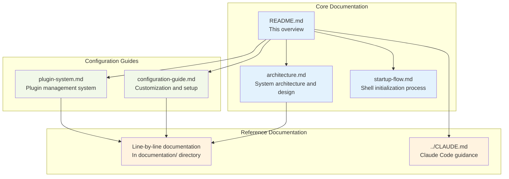

# Dotfiles Documentation

## Overview

This documentation directory provides comprehensive guides for understanding, configuring, and maintaining the dotfiles system. The documentation is organized into specialized guides covering different aspects of the shell environment configuration.

## Documentation Structure



## Quick Navigation

### 🏗️ [Architecture Documentation](architecture.md)
Comprehensive overview of the system architecture, including:
- System component relationships
- Configuration loading hierarchy
- Tool integrations and security considerations
- Performance optimizations

### 🚀 [Startup Flow Documentation](startup-flow.md)
Detailed breakdown of the shell initialization process:
- Shell type decision trees
- Phase-by-phase startup sequence
- Plugin loading mechanisms
- Error handling and fallbacks

### ⚙️ [Configuration Guide](configuration-guide.md)
Practical guide for customizing the dotfiles:
- Common configuration tasks
- Adding aliases, functions, and plugins
- Advanced configuration patterns
- Maintenance and troubleshooting

### 🔌 [Plugin System Documentation](plugin-system.md)
Complete guide to the Antidote plugin management system:
- Plugin architecture and categories
- Bundle syntax and loading strategies
- Performance optimization
- Custom plugin development

### 📖 [Line-by-Line Documentation](./line-by-line.md)
Detailed explanation of every configuration file:
- File-by-file walkthrough
- Line-by-line explanations
- Configuration option details

## Quick Start

### For New Users

1. **Understand the Architecture**: Start with [architecture.md](architecture.md) to understand how the system works
2. **Learn the Startup Process**: Read [startup-flow.md](startup-flow.md) to understand shell initialization
3. **Customize Your Setup**: Use [configuration-guide.md](configuration-guide.md) for making changes

### For Developers

1. **System Design**: Review [architecture.md](architecture.md) for component relationships
2. **Plugin Development**: Study [plugin-system.md](plugin-system.md) for extension patterns
3. **Configuration Details**: Reference [line-by-line documentation](./line-by-line.md) for specifics

## Key Features Documented

### 🔧 **Modular Configuration System**
- XDG Base Directory compliance
- Modular `.zshrc.d/` configurations
- Conditional tool loading
- Performance optimization strategies

### 🎨 **Rich User Interface**
- Powerlevel10k theme with instant prompt
- Syntax highlighting and auto-suggestions
- Enhanced completions and 256-color support
- Smart history management with Atuin

### 🛠️ **Tool Integration**
- Git configuration with SSH signing
- VS Code editor integration
- Homebrew package management
- Container platform support (OrbStack)
- Development tool plugins (NVM, Yarn, etc.)

### 🔒 **Security Features**
- Automatic commit signing with 1Password
- Secrets filtering in command history
- HTTPS to SSH URL rewriting
- Environment isolation

### ⚡ **Performance Optimizations**
- Lazy loading of heavy components
- Plugin caching with Antidote
- Instant prompt for immediate availability
- Deduplicated PATH management

## Documentation Conventions

### Diagram Types

- **Architecture Diagrams**: Show system component relationships
- **Sequence Diagrams**: Illustrate process flows and interactions
- **Flowcharts**: Detail decision trees and conditional logic
- **Graph Diagrams**: Display hierarchical structures

### Code Examples

All code examples are syntax-highlighted and include:
- Context comments explaining purpose
- Best practice patterns
- Error handling approaches
- Performance considerations

### Cross-References

Documents include cross-references to:
- Related configuration files with line numbers
- Other documentation sections
- External tools and resources
- Troubleshooting guides

## Maintenance

This documentation is maintained alongside the dotfiles configuration and should be updated when:

- New features are added
- Configuration patterns change
- Tool integrations are modified
- Performance optimizations are implemented

### Contributing to Documentation

When making changes:

1. Update relevant diagrams if architecture changes
2. Add examples for new configuration patterns
3. Include troubleshooting information for common issues
4. Maintain cross-references between documents

## File Organization

```
docs/
├── README.md                  # This overview document
├── architecture.md            # System architecture and design
├── startup-flow.md            # Shell initialization process
├── configuration-guide.md     # Customization and setup guide
├── line-by-line.md            # Line-by-line configuration explanations
└── plugin-system.md           # Plugin management documentation

../CLAUDE.md                   # Claude Code guidance file
```

## Getting Help

### For Configuration Issues
1. Check [configuration-guide.md](configuration-guide.md) troubleshooting section
2. Review [startup-flow.md](startup-flow.md) for initialization problems
3. Consult [plugin-system.md](plugin-system.md) for plugin-related issues

### For Development Questions
1. Study [architecture.md](architecture.md) for system design
2. Review existing patterns in configuration files
3. Check [line-by-line documentation](./line-by-line.md) for details

### For Performance Problems
1. Use profiling tools documented in [configuration-guide.md](configuration-guide.md)
2. Review performance optimization strategies in [architecture.md](architecture.md)
3. Consider lazy loading patterns from [plugin-system.md](plugin-system.md)

This documentation provides a complete reference for understanding, using, and extending the dotfiles configuration system.
