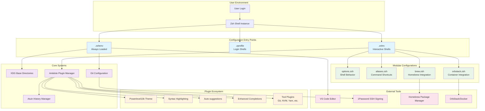
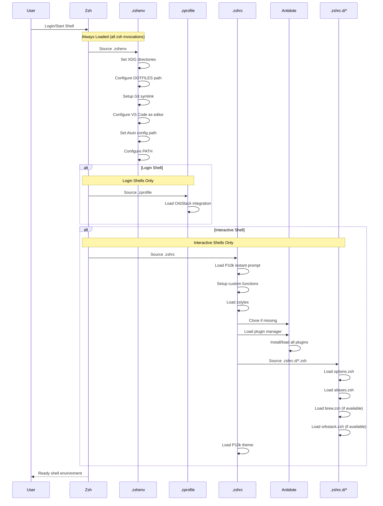
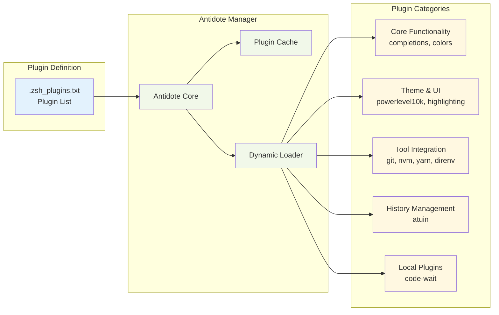

# Dotfiles Architecture Documentation

## Overview

This repository implements a modular, plugin-based shell environment configuration system for macOS using Zsh, Antidote plugin management, and comprehensive tooling integration.

## System Architecture



## Configuration Loading Flow



## Component Details

### Core Configuration Files

#### `.zshenv` - Environment Setup
- **Purpose**: Universal environment configuration loaded by all Zsh instances
- **Key Responsibilities**:
  - XDG Base Directory specification compliance
  - DOTFILES path configuration and validation
  - Git configuration symlink management
  - VS Code editor integration via `code-wait`
  - PATH configuration with user and system directories

#### `.zshrc` - Interactive Shell Configuration
- **Purpose**: Configuration for interactive shell sessions
- **Key Responsibilities**:
  - Powerlevel10k instant prompt loading
  - Custom function auto-loading from `.zfunctions`
  - Antidote plugin manager initialization
  - Modular configuration loading from `.zshrc.d/`
  - Theme configuration

#### `.zprofile` - Login Shell Setup
- **Purpose**: Login shell specific configuration
- **Key Responsibilities**:
  - OrbStack shell integration
  - Login-specific environment setup

### Plugin Management System



### Modular Configuration System

The `.zshrc.d/` directory contains specialized configuration modules:

1. **`options.zsh`** - Shell behavior configuration
   - Auto-cd functionality
   - Command correction
   - Extended globbing
   - History management

2. **`aliases.zsh`** - Command shortcuts and utilities
   - System utility aliases
   - File finding shortcuts
   - Configuration management helpers

3. **`brew.zsh`** - Homebrew integration
   - Conditional Homebrew environment setup
   - PATH and environment variable configuration

4. **`orbstack.zsh`** - Container platform integration
   - OrbStack shell initialization
   - Docker environment setup

### Tool Integrations

#### Git Configuration
- Global configuration with SSH signing via 1Password
- VS Code as default editor and diff tool
- Security-focused defaults (auto-signing, HTTPS→SSH rewriting)
- Comprehensive alias system

#### Atuin History Management
- Enhanced command history with sync capabilities
- Prefix-based search with directory-specific up-arrow behavior
- Compact UI with disabled previews for minimal distraction
- Privacy-focused with secrets filtering

#### VS Code Integration
- Custom `code-wait` wrapper for proper terminal editor behavior
- Configured as default editor for Git, Kubernetes, and system operations
- Seamless integration with shell workflows

## Directory Structure

```
dotfiles/
├── atuin/                    # Atuin history manager config
│   └── config.toml          # History search and sync settings
├── docs/                     # Documentation (this directory)
│   ├── README.md            # Repository overview
│   └── architecture.md      # This file
├── git/                      # Git configuration
│   ├── .gitconfig           # Global Git settings
│   └── .gitignore_global    # Global ignore patterns
└── zsh/                      # Zsh configuration
    ├── .zshenv              # Environment setup (always loaded)
    ├── .zprofile            # Login shell configuration
    ├── .zshrc               # Interactive shell setup
    ├── .zstyles             # Zsh completion and plugin styles
    ├── .p10k.zsh            # Powerlevel10k theme configuration
    ├── .zsh_plugins.txt     # Antidote plugin definitions
    ├── .zfunctions/         # Custom Zsh functions
    │   └── is-macos         # macOS detection utility
    ├── .zshrc.d/            # Modular configurations
    │   ├── aliases.zsh      # Command aliases
    │   ├── brew.zsh         # Homebrew integration
    │   ├── options.zsh      # Shell options
    │   └── orbstack.zsh     # Container integration
    └── plugins/             # Local plugins
        └── code-wait/       # VS Code editor wrapper
            └── code-wait    # Executable script
```

## Security Considerations

- **SSH Commit Signing**: All commits are automatically signed using SSH keys managed by 1Password
- **Secrets Filtering**: Atuin automatically filters common secrets (AWS keys, GitHub tokens, etc.) from history
- **HTTPS to SSH Rewriting**: GitHub URLs are automatically rewritten to use SSH for enhanced security
- **Environment Isolation**: Configuration respects XDG Base Directory specification for clean separation

## Performance Optimizations

- **Lazy Loading**: Heavy operations are deferred or conditionally loaded
- **Plugin Caching**: Antidote caches plugin installations for faster startup
- **Instant Prompt**: Powerlevel10k instant prompt provides immediate shell availability
- **Conditional Loading**: Tool integrations only load when tools are available
- **Deduplicated Paths**: PATH and FPATH arrays are automatically deduplicated

## Extensibility

The modular design allows for easy extension:

1. **New Plugins**: Add to `.zsh_plugins.txt` using Antidote bundle format
2. **Additional Modules**: Create new `.zsh` files in `.zshrc.d/`
3. **Custom Functions**: Add to `.zfunctions/` for automatic loading
4. **Tool Integration**: Follow existing patterns in modular configurations

This architecture provides a robust, maintainable, and extensible foundation for shell environment management.