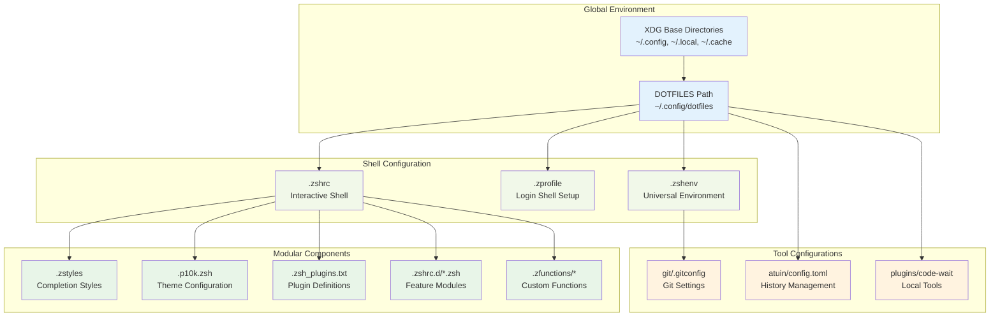
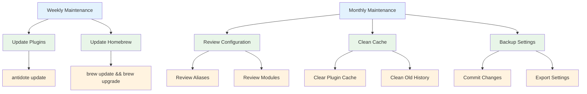
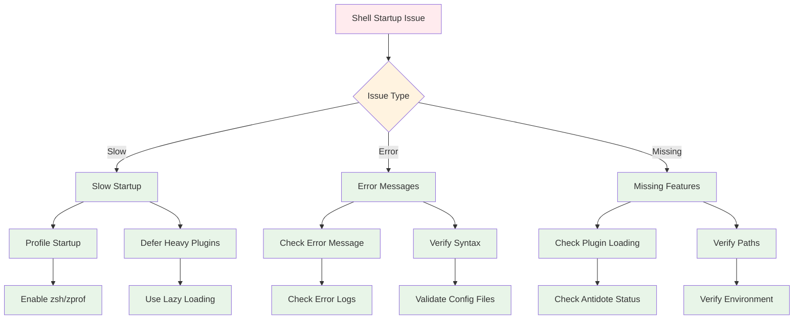

# Configuration Guide

## Overview

This guide provides comprehensive information for customizing and extending the dotfiles configuration, including best practices and common modification patterns.

## Configuration Hierarchy



## Common Configuration Tasks

### Adding New Shell Aliases

Create or edit module files in `.zshrc.d/`:

```bash
# Edit existing aliases
$EDITOR $DOTFILES/zsh/.zshrc.d/aliases.zsh

# Or create a new module
$EDITOR $DOTFILES/zsh/.zshrc.d/my-aliases.zsh
```

**Example aliases.zsh additions:**
```bash
# Development shortcuts
alias gs='git status'
alias gp='git push'
alias gc='git commit -m'
alias ..='cd ..'
alias ...='cd ../..'

# System utilities
alias ll='eza -la --icons'
alias tree='eza --tree'
alias cat='bat'

# Quick navigation
alias projects='cd ~/Projects'
alias dotfiles='cd $DOTFILES'
```

### Adding New Zsh Plugins

Edit the plugin list file:

```bash
$EDITOR $DOTFILES/zsh/.zsh_plugins.txt
```

**Plugin addition patterns:**
```bash
# Basic GitHub plugin
author/repository

# Oh My Zsh plugin
ohmyzsh/ohmyzsh path:plugins/plugin-name

# Plugin with specific loading
author/repo kind:defer        # Lazy load
author/repo kind:fpath        # Completions only
author/repo kind:path         # Add to PATH

# Local plugin
file:$ZDOTDIR/plugins/my-plugin kind:path
```

### Creating Custom Functions

Add new functions to the `.zfunctions` directory:

```bash
# Create a new function
$EDITOR $DOTFILES/zsh/.zfunctions/my-function
```

**Example function:**
```bash
#!/bin/zsh
# my-function - Does something useful

# Function implementation
if [[ $# -eq 0 ]]; then
    echo "Usage: my-function <argument>"
    return 1
fi

# Your function logic here
echo "Processing: $1"
```

Functions are automatically loaded and available as commands.

### Configuring Git Settings

Edit the global Git configuration:

```bash
$EDITOR $DOTFILES/git/.gitconfig
```

**Common additions:**
```ini
[alias]
# Add your custom Git aliases
co = checkout
br = branch
ci = commit
st = status

[user]
# Set in ~/.gitconfig.local (included conditionally)
name = Your Name
email = your.email@example.com

[core]
# Add custom ignore patterns
excludesfile = ~/.config/dotfiles/git/.gitignore_global
```

### Customizing the Prompt Theme

Configure Powerlevel10k settings:

```bash
# Reconfigure interactively
p10k configure

# Or edit directly
$EDITOR $DOTFILES/zsh/.p10k.zsh
```

### Adding Environment Variables

Add to the appropriate configuration file:

```bash
# For all shells (including non-interactive)
$EDITOR $DOTFILES/zsh/.zshenv

# For interactive shells only
$EDITOR $DOTFILES/zsh/.zshrc.d/environment.zsh
```

**Example environment.zsh:**
```bash
#!/bin/zsh
# Environment variables for interactive shells

export EDITOR="code --wait"
export BROWSER="open"
export PAGER="less"

# Development paths
export GOPATH="$HOME/go"
export PYTHONPATH="$HOME/.local/lib/python3.9/site-packages"

# API keys and tokens (consider using a secrets manager)
export GITHUB_TOKEN="$(security find-generic-password -s github-token -w 2>/dev/null || echo '')"
```

## Advanced Configuration Patterns

### Conditional Loading Based on OS

```bash
# In .zshrc.d/conditional.zsh
if is-macos; then
    # macOS-specific configuration
    export HOMEBREW_PREFIX="/opt/homebrew"
    alias flushdns="sudo dscacheutil -flushcache"
elif [[ "$OSTYPE" == linux* ]]; then
    # Linux-specific configuration
    export HOMEBREW_PREFIX="/home/linuxbrew/.linuxbrew"
    alias open="xdg-open"
fi
```

### Tool-Specific Configuration

```bash
# In .zshrc.d/docker.zsh
if (( $+commands[docker] )); then
    # Docker is available
    alias dps='docker ps --format "table {{.Names}}\t{{.Status}}\t{{.Ports}}"'
    alias dclean='docker system prune -f'
    
    # Docker completion
    if [[ ! -f ~/.docker/completions/_docker ]]; then
        mkdir -p ~/.docker/completions
        curl -L https://raw.githubusercontent.com/docker/cli/master/contrib/completion/zsh/_docker \
            > ~/.docker/completions/_docker
    fi
    fpath=(~/.docker/completions $fpath)
fi
```

### Performance-Optimized Loading

```bash
# In .zshrc.d/performance.zsh

# Lazy load heavy tools
lazy_load_nvm() {
    unfunction nvm node npm npx
    export NVM_DIR="$HOME/.nvm"
    [ -s "$NVM_DIR/nvm.sh" ] && \. "$NVM_DIR/nvm.sh"
    [ -s "$NVM_DIR/bash_completion" ] && \. "$NVM_DIR/bash_completion"
}

# Create placeholder functions
if [[ -d "$HOME/.nvm" ]]; then
    nvm() { lazy_load_nvm; nvm "$@"; }
    node() { lazy_load_nvm; node "$@"; }
    npm() { lazy_load_nvm; npm "$@"; }
    npx() { lazy_load_nvm; npx "$@"; }
fi
```

## Configuration File Templates

### New Module Template

```bash
#!/bin/zsh
# module-name.zsh - Brief description of module purpose

# Check if required tools are available
if ! (( $+commands[required-tool] )); then
    return 0
fi

# Module configuration
export MODULE_VAR="value"

# Aliases
alias shortcut='long-command'

# Functions
module_function() {
    # Function implementation
    echo "Module function executed"
}

# Completion setup
if [[ -f /path/to/completions ]]; then
    source /path/to/completions
fi
```

### Custom Plugin Template

```bash
#!/bin/zsh
# plugin-name.plugin.zsh - Plugin main file

# Plugin metadata
# PLUGIN_NAME: plugin-name
# PLUGIN_VERSION: 1.0.0
# PLUGIN_DESCRIPTION: Brief description

# Initialize plugin
if [[ -z "$PLUGIN_NAME_LOADED" ]]; then
    export PLUGIN_NAME_LOADED=1
    
    # Plugin initialization code
    plugin_init() {
        # Initialization logic
        echo "Plugin initialized"
    }
    
    # Auto-initialize if in interactive shell
    if [[ -o interactive ]]; then
        plugin_init
    fi
fi

# Export plugin functions
autoload -Uz plugin_function
```

## Maintenance and Updates

### Regular Maintenance Tasks



### Update Commands

```bash
# Update all plugins
antidote update

# Update Homebrew packages
brew update && brew upgrade

# Update system packages (macOS)
softwareupdate -i -a

# Clean plugin cache
antidote purge && antidote install

# Clean Homebrew cache
brew cleanup

# Clean shell history (if needed)
# Be careful with this command
history -c && history -w
```

### Backup and Restore

```bash
# Backup current configuration
cp -r $DOTFILES ~/dotfiles-backup-$(date +%Y%m%d)

# Create git backup
cd $DOTFILES
git add -A
git commit -m "Backup: $(date)"

# Restore from backup
cd ~/dotfiles-backup-YYYYMMDD
cp -r . $DOTFILES/
```

## Troubleshooting Common Issues

### Shell Startup Problems



### Debug Commands

```bash
# Profile shell startup time
zmodload zsh/zprof
# Start new shell, then run:
zprof

# Check plugin status
antidote list

# Verify configuration syntax
zsh -n ~/.zshrc

# Test specific module
source $DOTFILES/zsh/.zshrc.d/module-name.zsh

# Check PATH and environment
echo $PATH | tr ':' '\n'
env | grep -E '^(EDITOR|DOTFILES|ZDOTDIR)='
```

This configuration guide provides the foundation for customizing and maintaining your shell environment effectively.