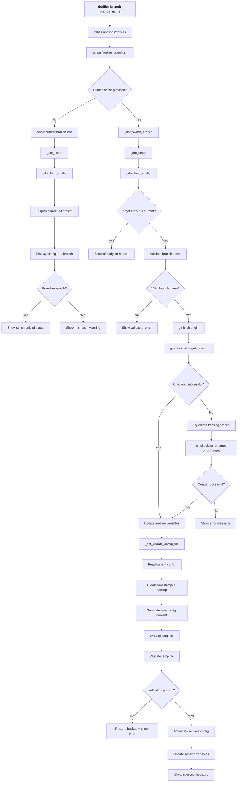

# dotfiles branch - Command Flow

## Overview

The `dotfiles branch` command manages branch switching for the dotfiles repository. It updates both the git repository branch and the configuration file to keep them synchronized.

## Command Flow Diagram

## Usage Modes

### Display Current Branch (`dotfiles branch`)
- **Purpose**: Show current branch status and configuration
- **Output**: 
  - Current git repository branch
  - Configured branch setting
  - Synchronization status

### Switch Branch (`dotfiles branch <name>`)
- **Purpose**: Switch both git branch and configuration
- **Process**:
  1. Validates branch name format
  2. Attempts git checkout
  3. Creates tracking branch if needed
  4. Updates configuration file
  5. Updates session variables

## Key Functions

### _dot_switch_branch
- **Purpose**: Orchestrate the complete branch switching process
- **Steps**:
  1. Environment validation via `_dot_setup`
  2. Branch validation and git operations
  3. Configuration file updates
  4. Session variable updates

### Branch Validation
- **Pattern**: `^[a-zA-Z0-9._/-]+$`
- **Restrictions**: 
  - Cannot start or end with `.` or `-`
  - Cannot contain `..` sequences
  - Must be valid git branch name

### Git Operations
- **Fetch**: Always fetches latest remote refs
- **Checkout**: Attempts existing local branch first
- **Tracking**: Creates tracking branch if local doesn't exist
- **Validation**: Verifies checkout success

### Configuration Update
- **File**: Updates `selected_branch` in config file
- **Safety**: Creates backup before modification
- **Atomicity**: Uses temp file and rename
- **Validation**: Ensures config remains valid

## Branch Synchronization

### Current State Detection
- **Git branch**: `git branch --show-current`
- **Config branch**: Parsed from `dotfiles.conf`
- **Comparison**: Identifies mismatches

### Synchronization Process
1. **Git repository**: Switch via `git checkout`
2. **Config file**: Update `selected_branch` setting
3. **Session variables**: Update `_DOT_SELECTED_BRANCH`
4. **Runtime state**: Update `_DOT_TARGET_BRANCH`

## Error Handling

### Branch Validation Errors
- **Invalid format**: Shows pattern requirements
- **Empty name**: Shows usage help
- **Reserved names**: Prevents problematic branches

### Git Operation Errors
- **Fetch failure**: Shows network/connectivity issues
- **Checkout failure**: Attempts tracking branch creation
- **Remote branch missing**: Shows available branches

### Configuration Errors
- **Backup failure**: Prevents config update
- **Validation failure**: Restores from backup
- **Write failure**: Shows permission issues

## Safety Features

### Backup Strategy
- **When**: Before any config file modification
- **Format**: `dotfiles.conf.backup_YYYYMMDD_HHMMSS`
- **Restoration**: Automatic on validation failure

### Atomic Updates
- **Method**: Write to temp file, validate, then rename
- **Rollback**: Automatic restoration from backup
- **Consistency**: Ensures config never left in invalid state

### Validation Chain
1. **Branch name format**: Regex validation
2. **Git operations**: Verify checkout success
3. **Config syntax**: Validate updated config file
4. **Runtime state**: Update session variables

## Branch Management

### Local vs Remote Branches
- **Local exists**: Direct checkout
- **Local missing**: Creates tracking branch from remote
- **Remote missing**: Shows error with available branches

### Tracking Branch Creation
- **Command**: `git checkout -b <branch> origin/<branch>`
- **Fallback**: If direct checkout fails
- **Validation**: Ensures proper upstream tracking

### Session Consistency
- **Variables updated**: 
  - `_DOT_SELECTED_BRANCH` (config value)
  - `_DOT_TARGET_BRANCH` (runtime target)
  - `_DOT_CURRENT_BRANCH` (actual git branch)
- **Persistence**: Config file ensures persistence across sessions