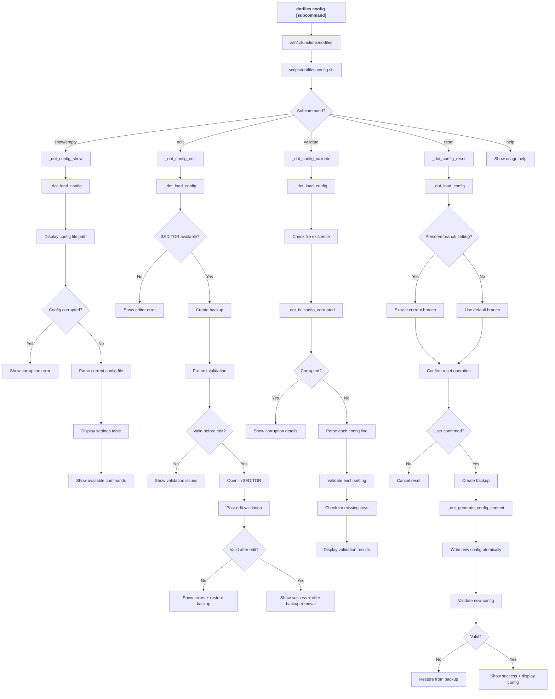

# dotfiles config - Command Flow

## Overview

The `dotfiles config` command provides comprehensive configuration management including display, editing, validation, and reset operations. It supports multiple subcommands for different configuration tasks.

## Command Flow Diagram

## Subcommands

### show (default)
- **Purpose**: Display current configuration settings
- **Output**: Table showing current values vs defaults
- **Features**: 
  - Shows config file path and status
  - Detects and reports corruption
  - Displays all settings in tabular format

### edit
- **Purpose**: Interactive configuration editing
- **Process**:
  1. Creates timestamped backup
  2. Validates config before editing
  3. Opens in `$EDITOR`
  4. Validates after editing
  5. Restores backup if validation fails
- **Safety**: Automatic backup and validation

### validate
- **Purpose**: Comprehensive configuration validation
- **Checks**:
  - File existence and readability
  - Syntax validation (key=value format)
  - Value validation (regex patterns, ranges)
  - Missing required keys
  - Corruption detection

### reset
- **Purpose**: Reset configuration to defaults
- **Features**:
  - Preserves current branch setting if valid
  - Creates backup before reset
  - Confirms operation with user
  - Atomic replacement (temp file → rename)
  - Validates new configuration

## Key Functions

### _dot_config_show
- **Purpose**: Display current configuration in formatted table
- **Logic**: 
  - Parses config file to show file values
  - Compares with current runtime values
  - Shows defaults for reference

### _dot_config_edit
- **Purpose**: Safe interactive editing with backup/restore
- **Safety measures**:
  - Pre-edit backup creation
  - Pre and post-edit validation
  - Automatic restoration on validation failure
  - User confirmation for backup removal

### _dot_config_validate
- **Purpose**: Detailed validation with error reporting
- **Validation types**:
  - Structural (file format)
  - Syntactic (key=value pairs)
  - Semantic (value validation)
  - Completeness (required keys)

### _dot_config_reset
- **Purpose**: Safe reset to defaults with branch preservation
- **Logic**:
  - Attempts to preserve valid branch setting
  - Uses `_dot_generate_config_content` for consistency
  - Atomic file replacement
  - Backup and rollback on failure

## Configuration Schema

### Validation Rules
- **selected_branch**: `^[a-zA-Z0-9._/-]+$`
- **cache_duration**: `^[0-9]+$` (1 to 86400000)
- **network_timeout**: `^[0-9]+$` (1 to 300)
- **auto_update_antidote**: `^(true|false)$`
- **auto_update_dotfiles**: `^(true|false)$`

### Default Values
- **selected_branch**: `main`
- **cache_duration**: `172800` (2 days)
- **network_timeout**: `30` seconds
- **auto_update_antidote**: `true`
- **auto_update_dotfiles**: `true`

## Error Handling

### Corruption Detection
- **Missing file**: Creates template
- **Invalid syntax**: Shows specific line errors
- **Invalid values**: Shows validation failures
- **Missing keys**: Lists required keys

### Edit Safety
- **No editor**: Shows installation suggestions
- **Validation failure**: Restores backup automatically
- **Backup failure**: Prevents edit operation

### Reset Safety
- **Backup failure**: Prevents reset operation
- **Validation failure**: Restores original config
- **User cancellation**: No changes made

## File Operations

### Backup Strategy
- **Naming**: Timestamped backups (`config.backup_YYYYMMDD_HHMMSS`)
- **Location**: Same directory as config file
- **Cleanup**: Optional user-prompted removal after successful operations

### Atomic Updates
- **Method**: Write to temp file, then rename
- **Validation**: Validates temp file before replacement
- **Rollback**: Automatic restoration from backup on failure