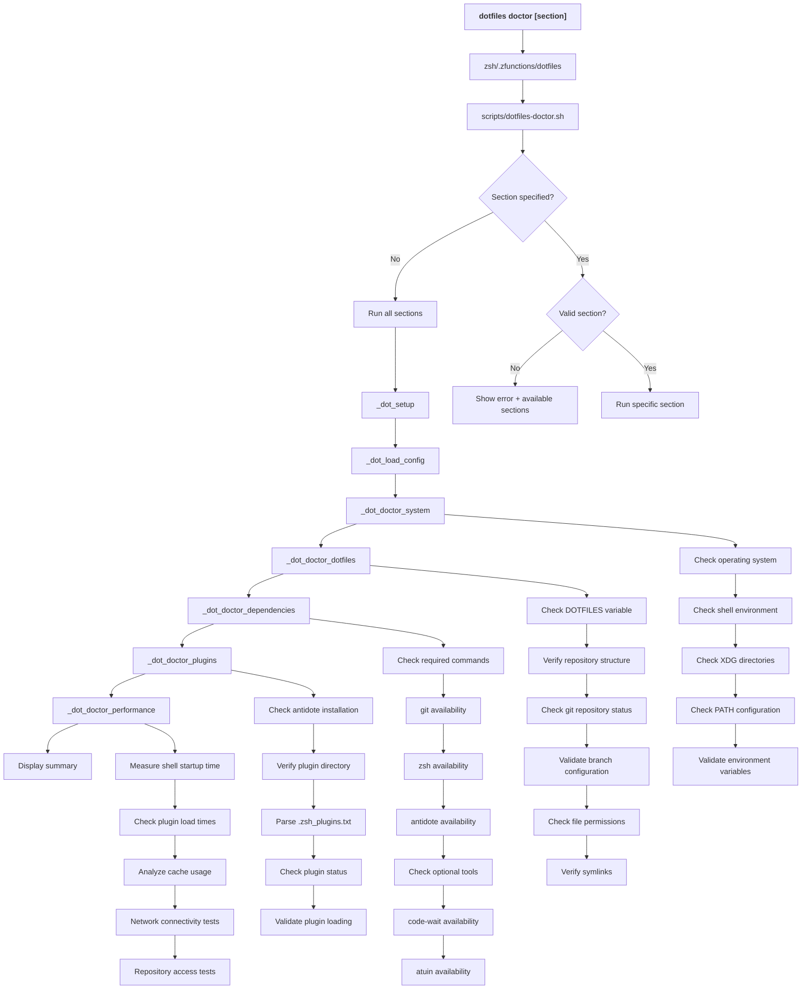

# dotfiles doctor - Command Flow

## Overview

The `dotfiles doctor` command provides comprehensive system diagnostics for the dotfiles environment. It can run all diagnostic sections or focus on specific areas to help troubleshoot configuration and environment issues.

## Command Flow Diagram



## Diagnostic Sections

### system
- **Purpose**: Validate core system environment
- **Checks**:
  - Operating system detection
  - Shell type and version
  - XDG directory configuration
  - PATH and environment variables
  - File system permissions

### dotfiles
- **Purpose**: Validate dotfiles repository and configuration
- **Checks**:
  - `DOTFILES` environment variable
  - Repository directory structure
  - Git repository status and health
  - Branch configuration consistency
  - File permissions and ownership
  - Symlink integrity

### dependencies
- **Purpose**: Check required and optional command availability
- **Required Tools**:
  - `git` - Version control operations
  - `zsh` - Shell environment
  - Standard UNIX tools (`grep`, `sed`, `awk`)
- **Optional Tools**:
  - `antidote` - Plugin manager
  - `code-wait` - VS Code integration
  - `atuin` - Enhanced history

### plugins
- **Purpose**: Validate Zsh plugin system
- **Checks**:
  - Antidote installation and version
  - Plugin directory structure
  - `.zsh_plugins.txt` syntax validation
  - Individual plugin availability
  - Plugin loading performance
  - Dependency conflicts

### performance
- **Purpose**: Analyze system performance characteristics
- **Metrics**:
  - Shell startup time measurement
  - Plugin load time analysis
  - Cache hit/miss ratios
  - Network connectivity speed
  - Repository access latency

## Key Functions

### _dot_doctor_system
- **Purpose**: Core system environment validation
- **Process**:
  1. OS and architecture detection
  2. Shell version and capabilities
  3. XDG Base Directory compliance
  4. Environment variable validation
  5. File system permission checks

### _dot_doctor_dotfiles
- **Purpose**: Dotfiles-specific environment validation
- **Process**:
  1. Repository structure verification
  2. Git status and configuration
  3. Branch synchronization check
  4. Symlink integrity validation
  5. Configuration file validation

### _dot_doctor_dependencies
- **Purpose**: Command and tool availability assessment
- **Process**:
  1. Required command detection
  2. Version compatibility checking
  3. Optional tool availability
  4. Integration point validation
  5. Missing dependency reporting

### _dot_doctor_plugins
- **Purpose**: Plugin system health assessment
- **Process**:
  1. Antidote installation verification
  2. Plugin configuration parsing
  3. Individual plugin status
  4. Load order validation
  5. Conflict detection

### _dot_doctor_performance
- **Purpose**: Performance characteristic analysis
- **Process**:
  1. Shell startup benchmarking
  2. Plugin load time measurement
  3. Cache efficiency analysis
  4. Network performance testing
  5. Optimization recommendations

## Diagnostic Output

### Status Indicators
- ✅ **Pass**: Green checkmark for successful checks
- ⚠️ **Warning**: Yellow warning for non-critical issues
- ❌ **Error**: Red X for critical problems
- ℹ️ **Info**: Blue info for informational messages

### Severity Levels
- **Critical**: Prevents basic functionality
- **Warning**: May cause degraded performance
- **Info**: Informational or optimization suggestions

### Report Format
```
🔍 System Diagnostics
  ✅ Operating System: macOS 14.5.0
  ✅ Shell: zsh 5.9
  ⚠️  XDG_CONFIG_HOME: Using default (~/.config)
  
📁 Dotfiles Environment
  ✅ DOTFILES variable: /Users/user/.config/dotfiles
  ✅ Repository structure: Valid
  ❌ Git status: Uncommitted changes detected
  
⚙️  Dependencies
  ✅ git: 2.39.0
  ✅ zsh: 5.9
  ⚠️  antidote: Not in PATH (loaded via script)
```

## Error Detection

### Common Issues
1. **Missing DOTFILES variable**: Environment not properly initialized
2. **Invalid repository**: Corrupted or missing git repository
3. **Branch mismatch**: Git branch ≠ configuration branch
4. **Permission issues**: Incorrect file/directory permissions
5. **Missing dependencies**: Required commands not available
6. **Plugin failures**: Antidote or plugin loading issues
7. **Performance degradation**: Slow startup or high resource usage

### Resolution Guidance
- **Problem identification**: Clear description of detected issues
- **Impact assessment**: Explanation of how issues affect functionality
- **Resolution steps**: Specific commands or actions to resolve
- **Prevention tips**: How to avoid similar issues in future

## Usage Patterns

### Quick Health Check
```bash
dotfiles doctor
```
- Runs all diagnostic sections
- Provides comprehensive system overview
- Identifies all potential issues

### Focused Diagnostics
```bash
dotfiles doctor system      # System environment only
dotfiles doctor plugins     # Plugin system only
dotfiles doctor performance # Performance analysis only
```

### Troubleshooting Workflow
1. **Initial assessment**: Run full diagnostic
2. **Issue identification**: Focus on failing sections
3. **Targeted debugging**: Run specific section repeatedly
4. **Verification**: Re-run diagnostics after fixes