# dotfiles update - Command Flow

## Overview

The `dotfiles update` command pulls the latest changes from the remote repository, handles branch switching if needed, and updates Antidote plugins. This is the primary command for keeping your dotfiles synchronized with the remote repository.

## Command Flow Diagram

```mermaid
flowchart TD
    A["`**dotfiles update**`"] --> B[zsh/.zfunctions/dotfiles]
    B --> C[scripts/dotfiles-update.sh]
    C --> D[_dot_update]
    D --> E[_dot_setup]
    E --> F[_dot_load_config]
    F --> G{Config already loaded?}
    G -->|Yes| H[Return early]
    G -->|No| I[_dot_create_config_template]
    I --> J{Config corrupted?}
    J -->|Yes| K[Show warning if interactive]
    J -->|No| L[Load config from file]
    K --> M[Return error]
    L --> N[_dot_validate_config]
    N --> O[Export _DOT_CONFIG_LOADED=1]
    O --> P[Validate DOTFILES env var]
    P --> Q[Check dotfiles directory exists]
    Q --> R[Verify git repository]
    R --> S[Set _DOT_TARGET_BRANCH]
    S --> T[Get _DOT_CURRENT_BRANCH]
    T --> U[_dot_handle_branch_mismatch]
    U --> V{Branch mismatch?}
    V -->|Yes| W[Show mismatch warning]
    V -->|No| X[Continue update]
    W --> Y[Exit without updating]
    X --> Z[_dot_stash_local_changes]
    Z --> AA{Local changes?}
    AA -->|Yes| BB[git stash push]
    AA -->|No| CC[Continue]
    BB --> DD[_dot_perform_update]
    CC --> DD
    DD --> EE[_dot_switch_branch]
    EE --> FF{Need branch switch?}
    FF -->|Yes| GG[git fetch origin]
    FF -->|No| HH[Pull latest changes]
    GG --> II[git checkout target branch]
    II --> JJ[Update _DOT_CURRENT_BRANCH]
    JJ --> HH
    HH --> KK[git pull origin]
    KK --> LL{Auto-update Antidote?}
    LL -->|Yes| MM[Load antidote]
    LL -->|No| NN[Skip plugin update]
    MM --> OO[antidote update]
    OO --> PP[_dot_restore_stash]
    NN --> PP
    PP --> QQ{Stash existed?}
    QQ -->|Yes| RR[git stash pop]
    QQ -->|No| SS[Complete]
    RR --> SS
    SS --> TT[Show success message]
```

## Key Functions

### _dot_setup
- **Purpose**: Initialize configuration and validate environment
- **Key Actions**: 
  - Loads config via `_dot_load_config`
  - Validates `DOTFILES` environment variable
  - Checks git repository status
- **Exit Conditions**: Returns 1 if any validation fails

### _dot_handle_branch_mismatch
- **Purpose**: Detect and warn about branch configuration mismatches
- **Logic**: Compares `_DOT_CURRENT_BRANCH` (actual git branch) vs `_DOT_TARGET_BRANCH` (config setting)
- **Action**: Shows informational message and exits if mismatch detected

### _dot_stash_local_changes
- **Purpose**: Preserve local uncommitted changes before update
- **Logic**: Only creates stash if there are actual changes to preserve
- **Returns**: Boolean indicating whether stash was created

### _dot_perform_update
- **Purpose**: Execute the actual git update operations
- **Steps**:
  1. Switch branch if needed via `_dot_switch_branch`
  2. Pull latest changes with `git pull origin`
  3. Update Antidote plugins if enabled

## Configuration Dependencies

- **selected_branch**: Determines target branch for updates
- **auto_update_antidote**: Controls whether plugins are updated automatically
- **Branch validation**: Ensures user is aware of branch switches

## Error Handling

- **Config corruption**: Shows warning and uses defaults
- **Branch mismatch**: Informs user and exits cleanly
- **Git failures**: Displays error messages and attempts recovery
- **Stash conflicts**: Warns user about manual resolution needed

## Side Effects

- **Git repository state**: Updates to latest commit on target branch
- **Antidote plugins**: May update if auto-update enabled
- **Shell session**: Requires terminal restart to apply changes