# Terminal Startup Sequence

## Overview

When a new terminal session starts, the dotfiles system automatically initializes through a carefully orchestrated sequence of configuration loading, environment setup, and update checking. This process ensures a consistent, up-to-date shell environment.

## Startup Flow Diagram

```mermaid
flowchart TD
    A["`**New Terminal Session**`"] --> B[Zsh Initialization]
    B --> C[Load zsh/.zshenv]
    C --> D[Set XDG directories]
    D --> E[Export DOTFILES path]
    E --> F[Configure Git paths]
    F --> G[Setup PATH and environment]
    G --> H[setup_gitconfig_symlink]
    H --> I{Interactive shell?}
    I -->|No| J[End initialization]
    I -->|Yes| K[Load zsh/.zshrc]
    K --> L[Powerlevel10k instant prompt]
    L --> M[Autoload .zfunctions]
    M --> N[Load .zstyles]
    N --> O[Clone antidote if needed]
    O --> P[antidote load]
    P --> Q[Source .zshrc.d/*.zsh files]
    Q --> R[Load .p10k.zsh]
    R --> S[Process dotfiles.zsh]
    S --> T{Interactive shell?}
    T -->|No| U[Skip startup]
    T -->|Yes| V{Background mode?}
    V -->|Yes| W[dotfiles startup &!]
    V -->|No| X[dotfiles startup]

    %% startup flow
    W --> Y[Background startup execution]
    X --> Z[Synchronous startup execution]
    Y --> AA[_dot_check startup]
    Z --> AA
    AA --> BB[_dot_setup]
    BB --> CC[_dot_load_config]
    CC --> DD{Config already loaded?}
    DD -->|Yes| EE[Return early]
    DD -->|No| FF[_dot_create_config_template]
    FF --> GG{Config corrupted?}
    GG -->|Yes| HH{Interactive + not warned?}
    HH -->|Yes| II[Show corruption warning]
    HH -->|No| JJ[Use defaults silently]
    GG -->|No| KK[Load config values]
    II --> LL[Export _DOT_CONFIG_WARNED=1]
    JJ --> MM[_dot_validate_config]
    KK --> MM
    LL --> MM
    MM --> NN[Export _DOT_CONFIG_LOADED=1]
    NN --> OO[_dot_check_cache_validity]
    OO --> PP{auto_update_dotfiles disabled?}
    PP -->|Yes| QQ[Skip update check]
    PP -->|No| RR{Cache still valid?}
    RR -->|Yes| SS[Skip update check]
    RR -->|No| TT[_dot_handle_branch_mismatch]
    TT --> UU{Branch mismatch?}
    UU -->|Yes| VV[Show branch mismatch info]
    UU -->|No| WW[_dot_perform_remote_check]
    VV --> XX[End startup]
    WW --> YY{Can reach GitHub?}
    YY -->|No| ZZ[End silently]
    YY -->|Yes| AAA[git fetch origin]
    AAA --> BBB[Check commits behind]
    BBB --> CCC{Updates available?}
    CCC -->|No| DDD[Update cache timestamp]
    CCC -->|Yes| EEE[Show update notification]
    DDD --> FFF[End - up to date]
    EEE --> GGG[Show changelog link]
    GGG --> HHH[Show update command]
    HHH --> III[Update cache timestamp]
    III --> JJJ[End with update info]
```

## Terminal Startup Process

The terminal startup follows a multi-phase initialization sequence that establishes the environment, loads configurations, and performs automatic maintenance tasks.

## Documentation Complete

I've created comprehensive flow documentation for all dotfiles commands:

1. **flow-dotfiles-update.md** - Update command with git operations and branch switching
2. **flow-dotfiles-check.md** - Update checking with cache management and network operations
3. **flow-dotfiles-config.md** - Configuration management with editing, validation, and reset
4. **flow-dotfiles-branch.md** - Branch switching with git and config synchronization
5. **flow-dotfiles-doctor.md** - System diagnostics across multiple categories
6. **flow-terminal-startup.md** - Complete terminal initialization sequence

Each document includes:
- **Detailed Mermaid diagrams** showing function call flows
- **Narrative descriptions** explaining the process
- **Key function documentation** with purposes and logic
- **Error handling** and safety features
- **Configuration dependencies** and behavior

The diagrams trace the complete execution path from user command through all internal function calls, showing decision points, error handling, and the full operational flow of each dotfiles command.
