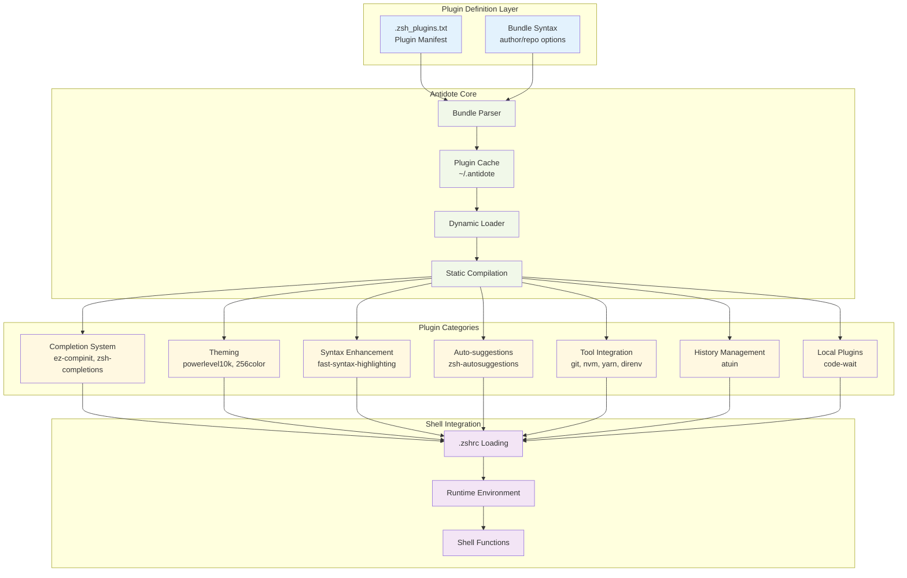
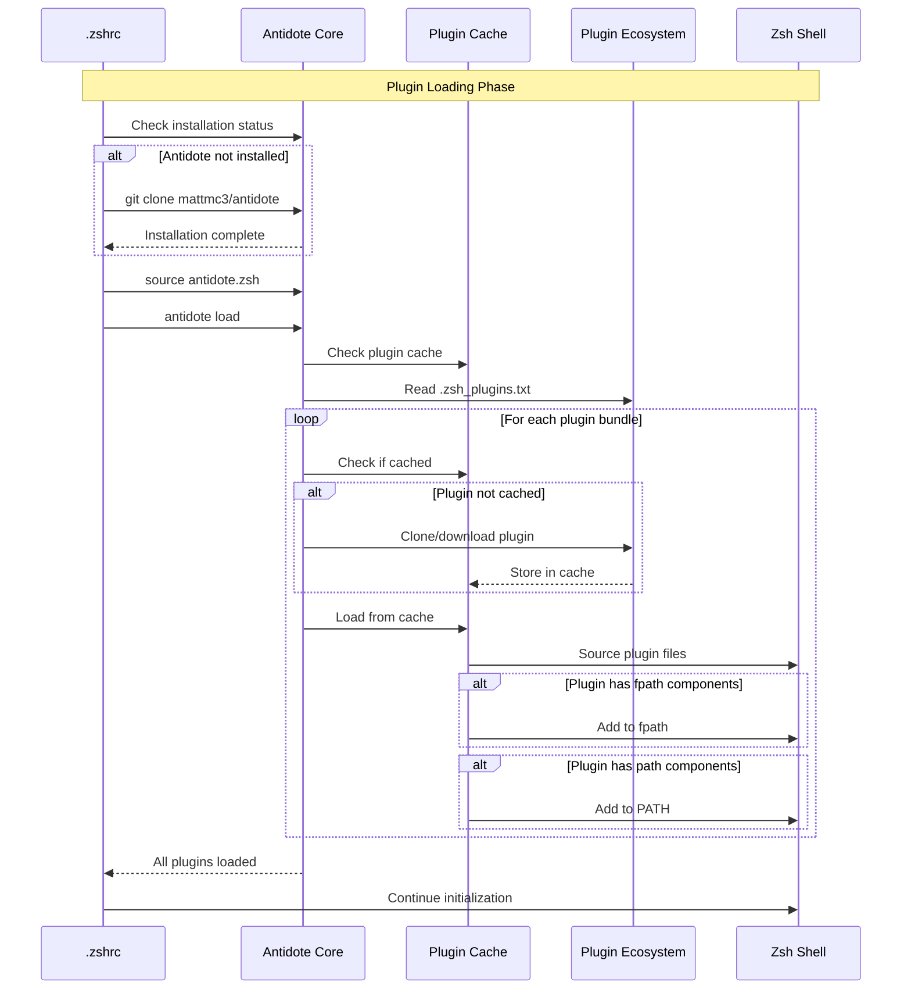
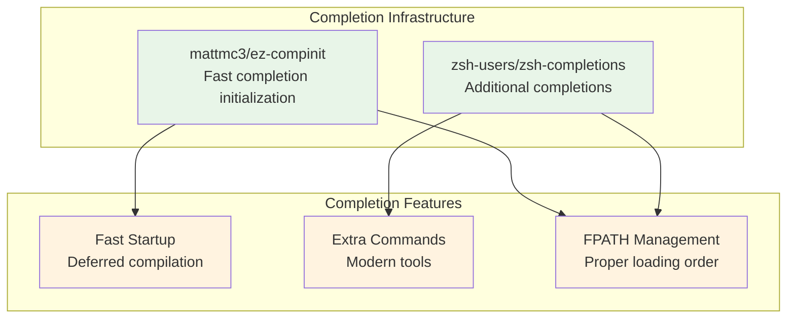
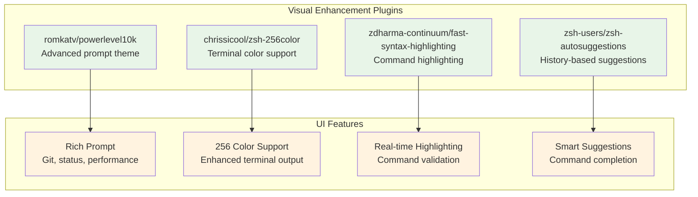
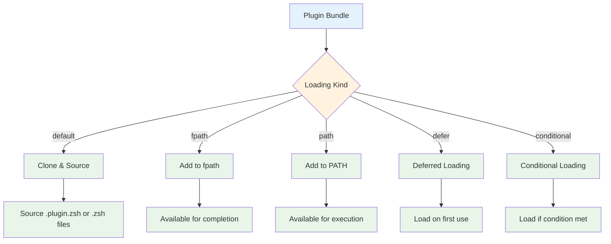
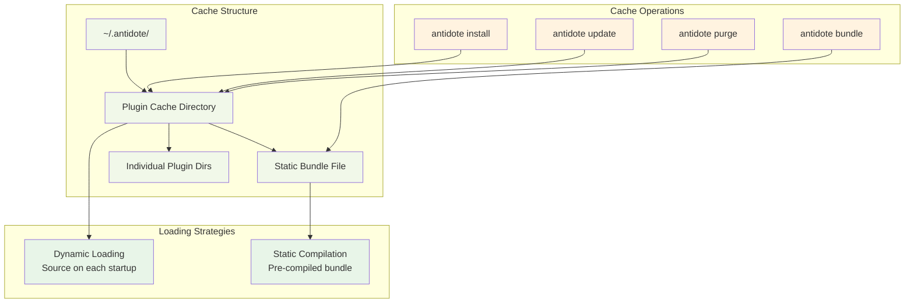
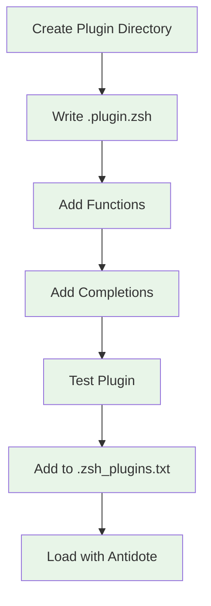
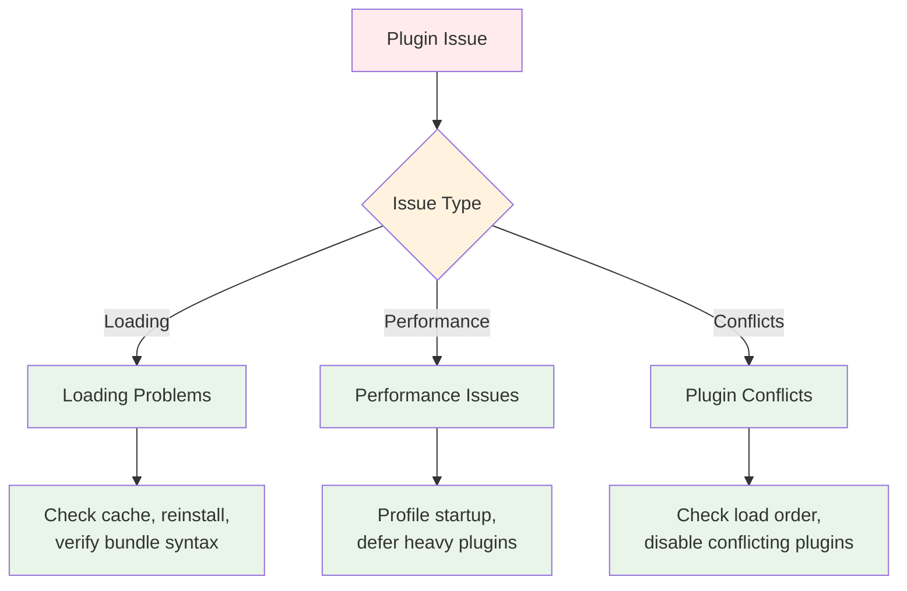

# Plugin Management System Documentation

## Overview

This document details the Antidote-based plugin management system used in this dotfiles configuration, including plugin categories, loading mechanisms, and extension patterns.

## Antidote Plugin Manager Architecture



## Plugin Loading Sequence



## Plugin Categories and Details

### 1. Completion System



### 2. User Interface Enhancement



### 3. Tool Integration

```mermaid
graph TD
    subgraph "Development Tools"
        GIT[ohmyzsh/ohmyzsh path:plugins/git<br/>Git aliases and functions]
        NVM[lukechilds/zsh-nvm<br/>Node version management]
        YARN[ohmyzsh/ohmyzsh path:plugins/yarn<br/>Yarn package manager]
        DIRENV[ohmyzsh/ohmyzsh path:plugins/direnv<br/>Directory environment]
    end
    
    subgraph "System Tools"
        VSCODE[ohmyzsh/ohmyzsh path:plugins/vscode<br/>VS Code integration]
        ITERM[ohmyzsh/ohmyzsh path:plugins/iterm2<br/>iTerm2 features]
        EZA[ohmyzsh/ohmyzsh path:plugins/eza<br/>Modern ls replacement]
        ATUIN[atuinsh/atuin<br/>Enhanced history]
    end
    
    subgraph "Local Tools"
        CODEWAIT[file:$ZDOTDIR/plugins/code-wait<br/>VS Code editor wrapper]
    end
    
    GIT --> SHORTCUTS[Git Shortcuts<br/>Aliases, status, log]
    NVM --> NODEENV[Node Environment<br/>Version switching]
    YARN --> PKGMGMT[Package Management<br/>Enhanced commands]
    DIRENV --> ENVLOAD[Environment Loading<br/>Per-directory config]
    
    VSCODE --> EDITOR[Editor Integration<br/>Shell commands]
    ITERM --> TERMINAL[Terminal Features<br/>Integration helpers]
    EZA --> LISTING[Enhanced Listing<br/>Icons, colors, tree]
    ATUIN --> HISTMGMT[History Management<br/>Search, sync, filter]
    
    CODEWAIT --> WAIT[Editor Waiting<br/>Proper terminal behavior]

    classDef devPlugin fill:#e8f5e8
    classDef sysPlugin fill:#f3e5f5
    classDef localPlugin fill:#fff3e0
    classDef feature fill:#e1f5fe

    class GIT,NVM,YARN,DIRENV devPlugin
    class VSCODE,ITERM,EZA,ATUIN sysPlugin
    class CODEWAIT localPlugin
    class SHORTCUTS,NODEENV,PKGMGMT,ENVLOAD,EDITOR,TERMINAL,LISTING,HISTMGMT,WAIT feature
```



## Bundle Syntax Reference

### Standard GitHub Bundles
```bash
# Basic GitHub repository
author/repository

# Specific subdirectory
ohmyzsh/ohmyzsh path:plugins/git

# Add to fpath only (for completions)
zsh-users/zsh-completions kind:fpath path:src

# Add to PATH
author/repository kind:path
```

### Local Plugin Bundles
```bash
# Local file system plugin
file:$ZDOTDIR/plugins/code-wait kind:path

# Local with specific loading behavior
file:/absolute/path/to/plugin kind:fpath
```

### Plugin Loading Kinds



## Plugin Cache Management



## Performance Optimization Strategies

### 1. Deferred Loading
```bash
# Load heavy plugins only when needed
author/heavy-plugin kind:defer

# Conditional loading based on command availability
$+commands[docker] && antidote load docker/cli
```

### 2. Static Compilation
```bash
# Generate static bundle for faster loading
antidote bundle <.zsh_plugins.txt >~/.zsh_plugins.zsh
source ~/.zsh_plugins.zsh
```

### 3. Selective Loading
```bash
# Load only specific parts of large plugin collections
ohmyzsh/ohmyzsh path:plugins/git
# Instead of loading entire oh-my-zsh
```

## Custom Plugin Development

### Local Plugin Structure
```
plugins/
└── custom-plugin/
    ├── custom-plugin.plugin.zsh    # Main plugin file
    ├── functions/                  # Custom functions
    │   ├── _custom_complete       # Completion function
    │   └── custom_helper          # Helper function
    └── README.md                  # Documentation
```

### Plugin Integration Pattern


## Troubleshooting Plugin Issues

### Common Problems and Solutions



### Debug Commands
```bash
# Show loaded plugins
antidote list

# Update all plugins
antidote update

# Clear plugin cache
antidote purge

# Reinstall specific plugin
antidote purge author/plugin && antidote install

# Profile shell startup
time zsh -i -c exit
```

This plugin system provides a robust, extensible foundation for shell enhancement while maintaining optimal performance and easy maintenance.