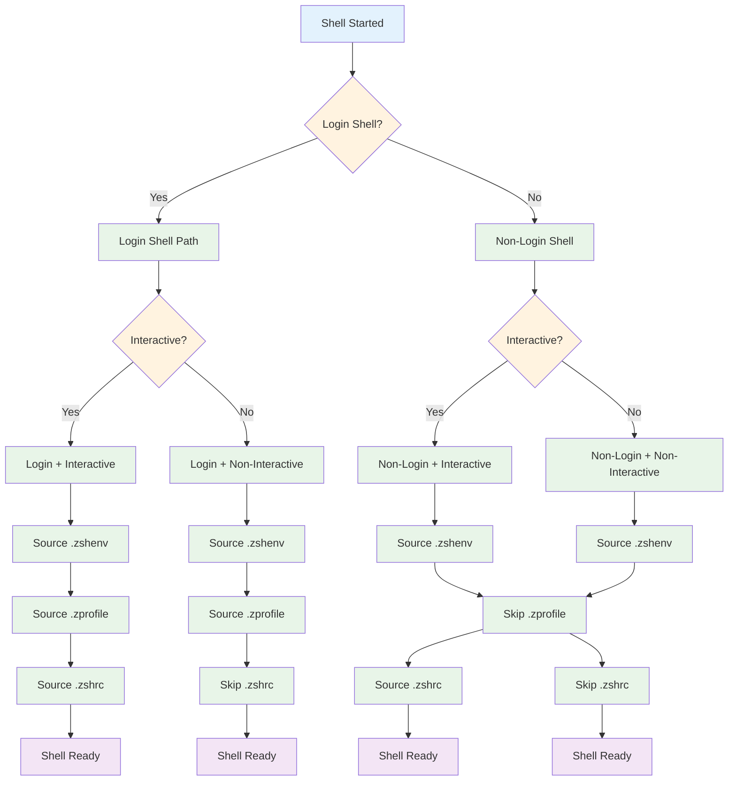
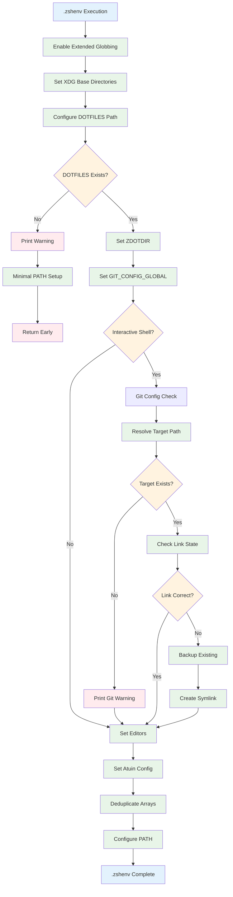
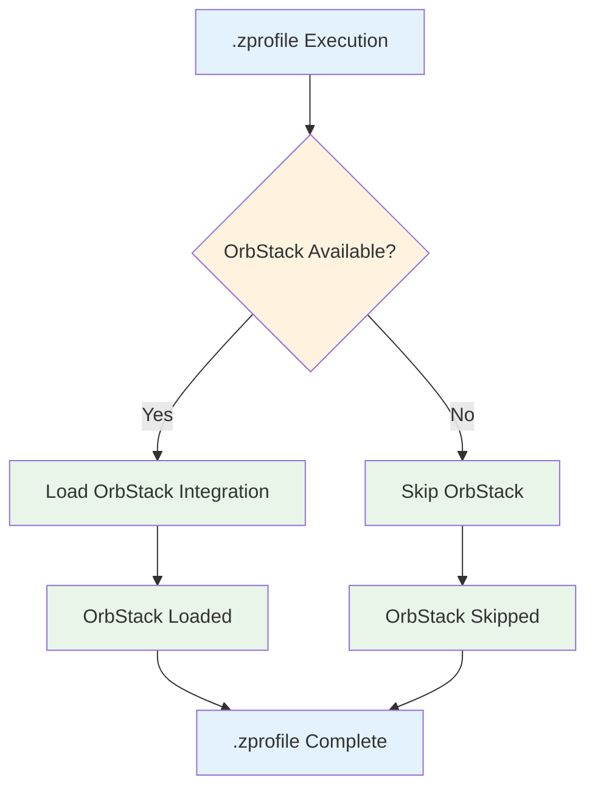
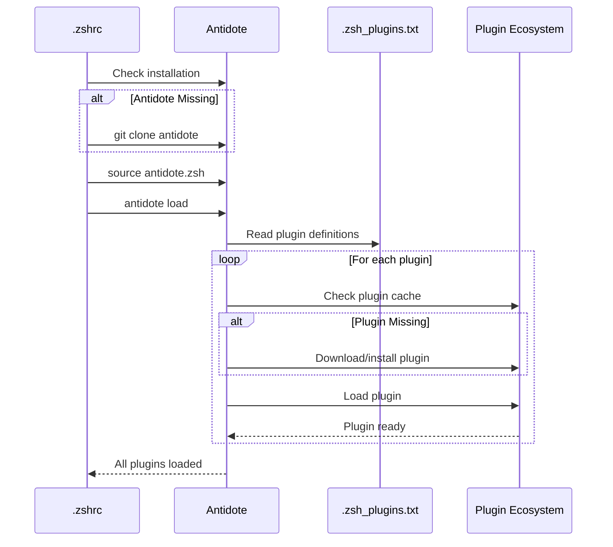
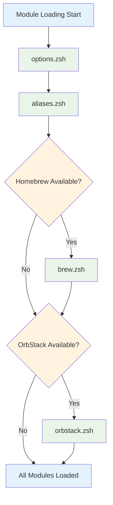
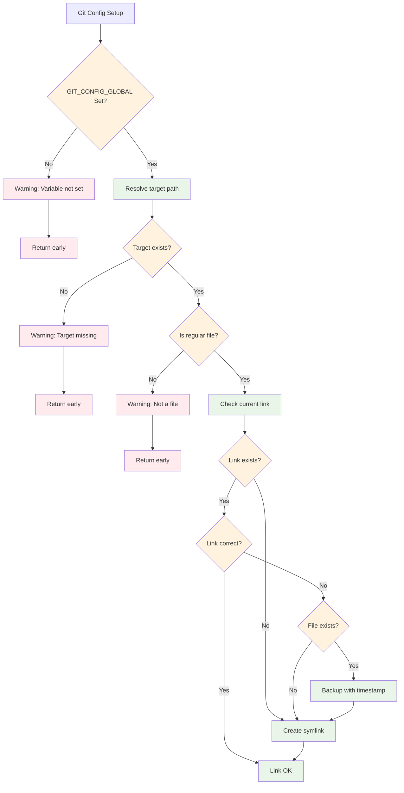
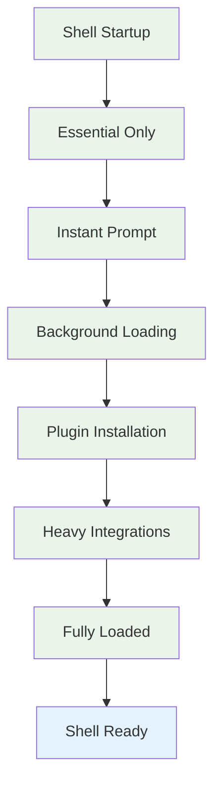

# Shell Startup Flow Documentation

## Overview

This document provides a detailed breakdown of the shell startup process, including decision trees and initialization flows for different shell types.

## Shell Type Decision Tree



## Detailed Startup Sequence

### Phase 1: Environment Setup (.zshenv)



### Phase 2: Login Shell Setup (.zprofile)



### Phase 3: Interactive Shell Setup (.zshrc)

```mermaid
flowchart TD
    START[.zshrc Execution] --> P10KCHECK{P10k Cache Exists?}
    P10KCHECK -->|Yes| P10KLOAD[Load Instant Prompt]
    P10KCHECK -->|No| P10KSKIP[Skip Instant Prompt]
    
    P10KLOAD --> FUNCS[Setup Custom Functions]
    P10KSKIP --> FUNCS
    
    FUNCS --> ZSTYLES{.zstyles Exists?}
    ZSTYLES -->|Yes| ZLOAD[Load .zstyles]
    ZSTYLES -->|No| ZSKIP[Skip .zstyles]
    
    ZLOAD --> ANTIDOTE
    ZSKIP --> ANTIDOTE[Check Antidote]
    
    ANTIDOTE --> ANTEXIST{Antidote Exists?}
    ANTEXIST -->|No| CLONE[Clone Antidote]
    ANTEXIST -->|Yes| LOAD[Load Antidote]
    
    CLONE --> LOAD
    LOAD --> PLUGINS[Load Plugins]
    PLUGINS --> MODULES[Source .zshrc.d modules]
    
    MODULES --> OPTIONS[Load options.zsh]
    OPTIONS --> ALIASES[Load aliases.zsh]
    ALIASES --> BREWCHECK{Brew Available?}
    
    BREWCHECK -->|Yes| BREWLOAD[Load brew.zsh]
    BREWCHECK -->|No| BREWSKIP[Skip brew.zsh]
    
    BREWLOAD --> ORBSTACKCHECK{OrbStack Available?}
    BREWSKIP --> ORBSTACKCHECK
    
    ORBSTACKCHECK -->|Yes| ORBSTACKLOAD[Load orbstack.zsh]
    ORBSTACKCHECK -->|No| ORBSTACKSKIP[Skip orbstack.zsh]
    
    ORBSTACKLOAD --> P10KTHEME
    ORBSTACKSKIP --> P10KTHEME{.p10k.zsh Exists?}
    
    P10KTHEME -->|Yes| P10KFINAL[Load P10k Theme]
    P10KTHEME -->|No| P10KFINALSKIP[Skip P10k Theme]
    
    P10KFINAL --> END[.zshrc Complete]
    P10KFINALSKIP --> END

    classDef startEnd fill:#e3f2fd
    classDef process fill:#e8f5e8
    classDef decision fill:#fff3e0

    class START,END startEnd
    class P10KLOAD,P10KSKIP,FUNCS,ZLOAD,ZSKIP,CLONE,LOAD,PLUGINS,MODULES,OPTIONS,ALIASES,BREWLOAD,BREWSKIP,ORBSTACKLOAD,ORBSTACKSKIP,P10KFINAL,P10KFINALSKIP process
    class P10KCHECK,ZSTYLES,ANTEXIST,BREWCHECK,ORBSTACKCHECK,P10KTHEME decision
```



## Plugin Loading Sequence



## Module Loading Order



## Error Handling and Fallbacks

### Git Configuration Symlink



### Tool Integration Fallbacks

```mermaid
graph TD
    BREW[Homebrew Check] --> BREWTEST{$+commands[brew]?}
    BREWTEST -->|Yes| BREWENV[Setup Homebrew environment]
    BREWTEST -->|No| BREWSKIP[Silent skip]
    
    ORBSTACK[OrbStack Check] --> ORBFILE{Init script exists?}
    ORBFILE -->|Yes| ORBLOAD[Source with error handling]
    ORBFILE -->|No| ORBSKIP[Silent skip]
    
    ANTIDOTE[Antidote Check] --> ANTDIR{Directory exists?}
    ANTDIR -->|No| ANTCLONE[Git clone repository]
    ANTDIR -->|Yes| ANTLOAD[Load existing installation]
    
    PLUGINS[Plugin Loading] --> PLUGINERR{Plugin error?}
    PLUGINERR -->|Yes| PLUGINCONT[Continue with next]
    PLUGINERR -->|No| PLUGINSUCCESS[Plugin loaded]

    classDef check fill:#fff3e0
    classDef success fill:#e8f5e8
    classDef skip fill:#f5f5f5
    classDef error fill:#ffebee

    class BREWTEST,ORBFILE,ANTDIR,PLUGINERR check
    class BREWENV,ORBLOAD,ANTLOAD,ANTCLONE,PLUGINSUCCESS success
    class BREWSKIP,ORBSKIP skip
    class PLUGINCONT error
```

## Performance Considerations

### Lazy Loading Strategy



This startup flow ensures maximum compatibility across different shell invocation scenarios while maintaining optimal performance through lazy loading and graceful fallbacks.